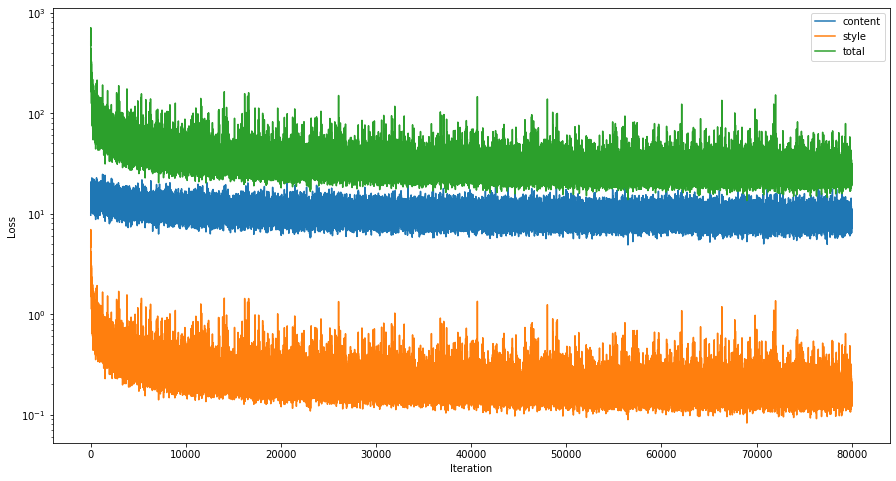
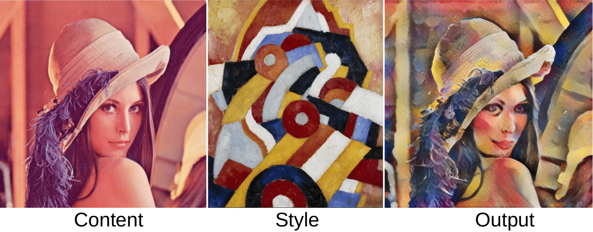
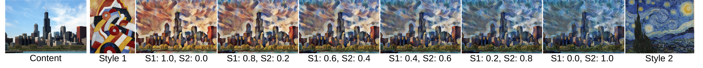
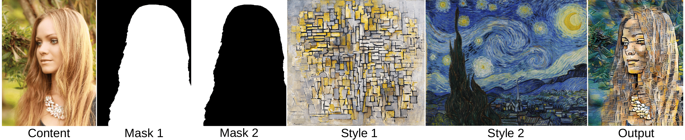
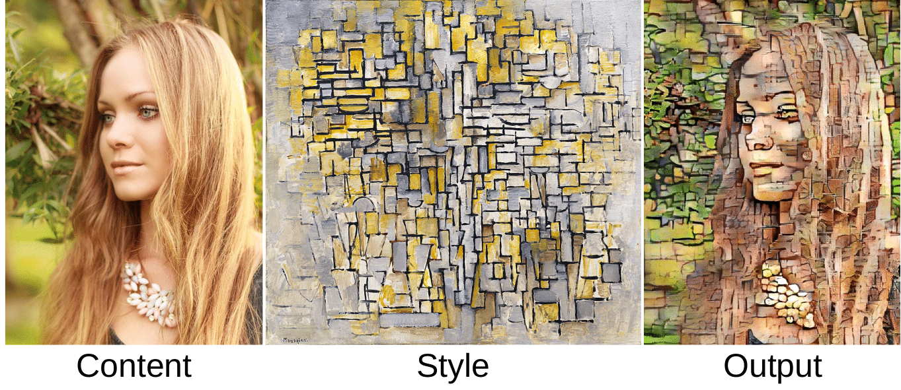

Adaptive Instance Normalization
---

**Unofficial Pytorch Implementation "Arbitrary Style Transfer in Real-time with Adaptive Instance Normalization"**

**Reference: [Arbitrary Style Transfer in Real-time with Adaptive Instance Normalization, ICCV 2017](https://arxiv.org/abs/1703.06868)**

**Contact**: `Minseong Kim` (tyui592@gmail.com)

Requirements
--
* torch (version: 1.2.0)
* torchvision (version: 0.4.0)
* Pillow (version: 6.1.0)
* matplotlib (version: 3.1.1)

Download
--
* The trained model can be downloaded through the [Google drive](https://drive.google.com/file/d/1CD4dxZb-vNmzlcFjM7ex2ldpjmUlZGUP/view?usp=sharing)
* Content dataset: [MSCOCO train2014](http://cocodataset.org/#download) is needed to train the network.
* Style dataset: [Painter by numbers](https://www.kaggle.com/c/painter-by-numbers/data) is needed to trian the network.


Usage
--

### Arguments
* `--train`: Train flag to learn the style transfer network
* `--content-dir`: Content dataset path for learn the style transfer network
* `--style-dir`: Style dataset path for learn the style transfer network
* `--imsize`: Size to resize the shorter side of the image (maintaining the aspect ratio)
* `--cropsize`: Size to crop the image
* `--cencrop`: Flag for crop the center region of the image (default: randomly crop)
* `--style-weight`: Style loss weight (If you want to enhance the style, increase this value to train the network)
* `--gpu-no`: Device no (-1: cpu, 0~N: gpu)
* `--content`: Source contenet image
* `--style`: Target style image
* `--mask`: Mask to generate masked stylized image
* `--style-strength`: Trade off factor between content and style (1.0: style, 0.0: content)
* `--interpolation-weights`: Interpolation weights of multiple styles
* `--load-path`: Model load path
* `--layers`: Layer Indices to extract content and style features
* `--preserve-color`: Flag for color preserved stylization

### Example Scripts

#### Training

```
python main.py --train --imsize 512 --cropsize 256 --content-dir ./coco2014/ --style-dir ./painter_by_numbers/
```
* Training loss




#### Generat the stylized image
```
python main.py --imsize 512 --content ./imgs/content/lena.jpg --style ./imgs/style/abstraction.jpg --load-path ./check_point.pth --style-strength 1.0
```

#### Generat the stylized image with multiple styles
```
python main.py --imsize 512 --content ./imgs/content/chicago.jpg --style ./imgs/style/abstraction.jpg ./imgs/style/starry_night.jpg --load-path ./check_point.pth --style-strength 1.0 --interpolation-weights 0.5 0.5
```

#### Generat the stylized image with multiple styles and masks
```
python main.py --imsize 512 --content ./imgs/content/blonde_girl.jpg --style ./imgs/style/mondrian.jpg ./imgs/style/starry_night.jpg --mask ./imgs/mask/blonde_girl_mask1.jpg ./imgs/mask/blonde_girl_mask2.jpg --load-path ./check_point.pth --style-strength 1.0 --interpolation-weights 1.0 1.0
```
#### Generat the color preserved stylized image
```
python main.py --imsize 512 --content ./imgs/content/blonde_girl.jpg --style ./imgs/style/mondrian.jpg --load-path ./check_point.pth --preserve-color
```

Results
--

#### Stylized image with single style


#### Stylized image with multiple styles


#### Stylized image with multiple styles and masks


#### Color preserved stylized image

